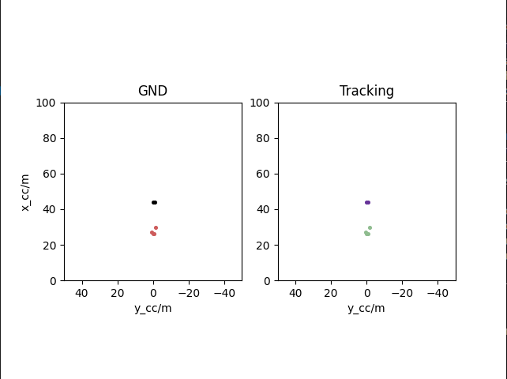

# Set up the environment
```
pip install -r requirements.txt
```
# Data Pipeline
1. Generate filterd data (remove outliers and static points) if they don't exist and save the validation set and the test set in `validation_data_without_static.pickle`, `validation_label_without_static.pickle`, `test_data_without_static.pickle`, `test_label_without_static.pickle`
```
export PYTHONPATH=.
python src/radar_scenes_val_test_generator.py --datapath datashort
```

It contains only sequence109 in `data_short/sequences.json`. If you want to test on the whole test set, use original `sequences.json` in RadarScenes.  

2. Run instance segmentor on the validation set to get segmented instances and saved in `data_short/Seq109_gnd&seg.npy` 
```
python src/save_insSeg_gnd.py 
        --datapath datashort
        --savepath data_short/Seq109_gnd&seg.npy
```
3. Tune the tracker on the validation set
```
python src/sort_instance.py
```
5. Evaluate on the test set

# Data Association Schemes
Data association is to assign hypothesis instances at time T+1 (generated by trackers) to those at time T.  

Data association can be divided into instance-level and point-level. For instance-level association, a tracker is initialized for each segmented instance. In this repo, we focuses on instance-level association and leave point-level script `src/sort_points.py` unfinished.  

To associate hypothesis instances accross time, we need to generate a cost matrix and solve the optimal assignment problem with Hungarian algorithm. To generate the cost matrix, there are two metrics that are used for instance-level association, i.e., convel hll IOU and Euclidean distance. We can generate a convex hull for each hypothesis instance and calculate the IOU area. We can also extract instances' mass center point and calculate their Euclidean distance. 

We use Kalman filter for prediciting for the future time frame. It relies on the motion model for prediction the location in t=T+1. We can use Doppler radial velocity for the motion model or let the filter to estimate. Thus there are four combinations:
```
├── sort_instance_convex_hull_no_trust_velocity.py
├── sort_instance_convex_hull.py
├── sort_instance_Euclidean_no_trust_velocity.py
├── sort_instance_Euclidean.py
```
There is also an unfinished script that try to combine the four scripts above.
```
├── src/radarMOTS_instance.py
```
Run the tracker and display an animation.
```
export PYTHONPATH=.
python src/sort_instance_Euclidean.py -d
```


# Evaluation
Evaluate the trackers and segmentors jointly by MOTSA, MOTSP, soft MOTSA. Find the definition in *MOTS: Multi-Object Tracking and Segmentation*. 
```
├── sort_instance_Euclidean_metirc.py
```
Get the metrics.
```
export PYTHONPATH=.
python src/sort_instance_Euclidean_metric.py
```